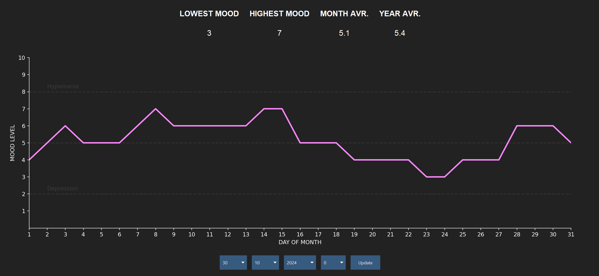

# Mood Tracker

I made this to track my own mood, I thought I might as well upload it for others to use.

## What it tracks

In its current form, it tracks:

* Daily mood
* Lowest Monthly Mood
* Highest Monthly Mood
* Monthly Average
* Yearly Average

Data is visualised over a period of a month, and is based on the month and year selection dropdowns.

<html>

</html>

